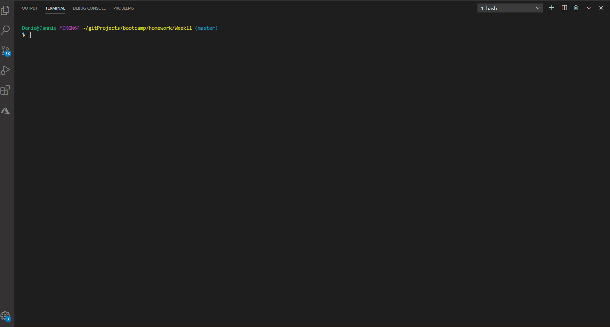

## Note Taker 
 
 
  
  

### DanielleRBeaty@gmail.com

---
### Description
###### Created an application that can be used to write, save, and delete notes. This application will used an express backend and save and retrieve note data from a JSON file. App is deployed on both gitpages and heroku. 
---
## Table of contents
* [How to Install](#how-to-Install)
* [How to Use](#how-to-Use)
* [Licenses](#Licenses)
* [Contributors](#Contributors)
* [App Functionality](#App-Fuctionality)
* [Special Thanks](#Special-Thanks)
---
### How to Install 
###### npm install

### How to Use
###### Launch https://hw-week11.herokuapp.com/
---
### Licenses
###### ISC
---
### Contributors
###### Danielle Beaty
---
### App Functionality

